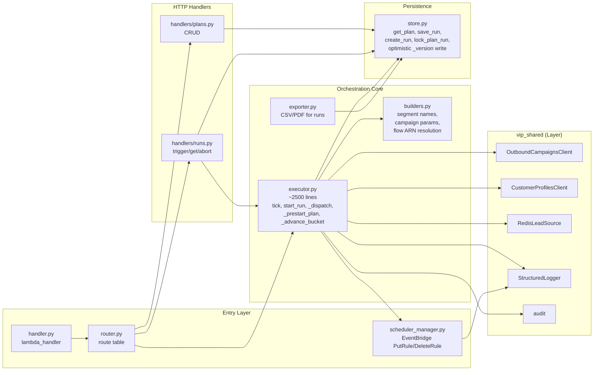
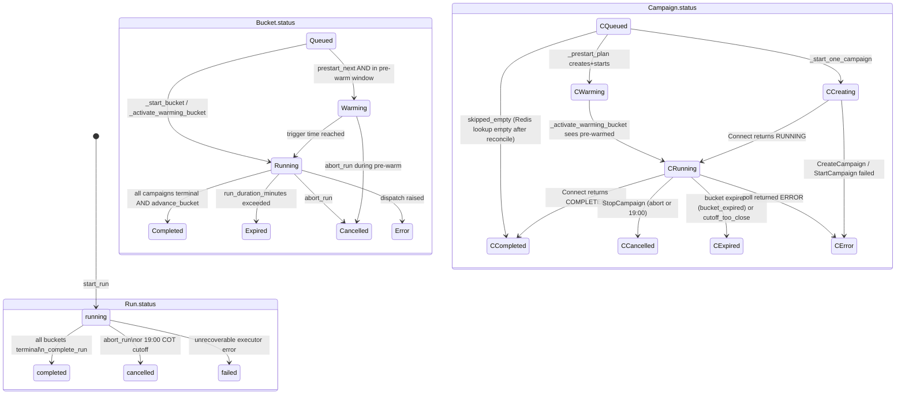
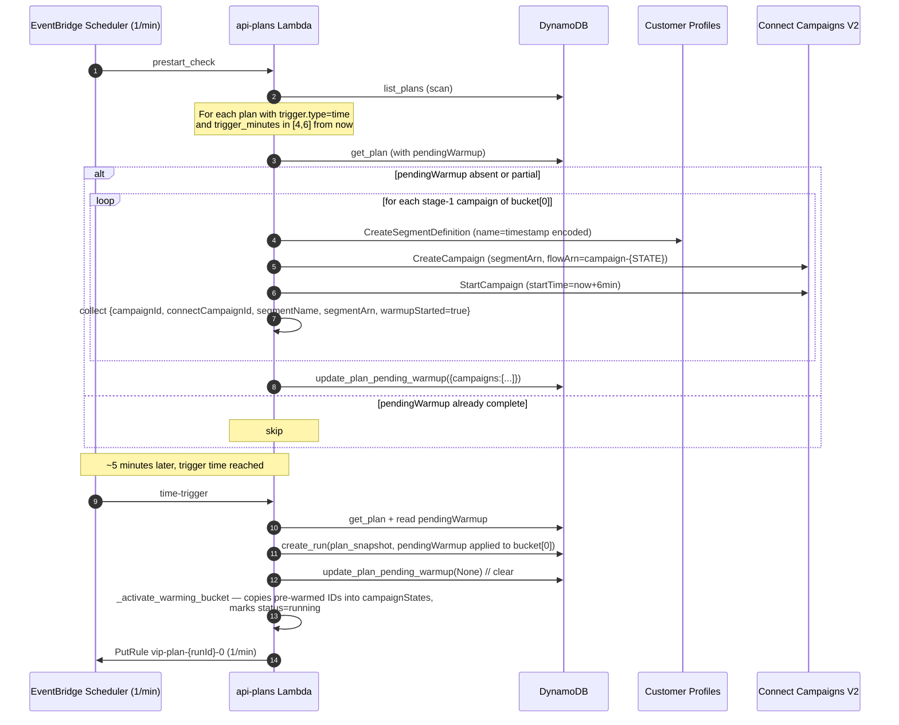
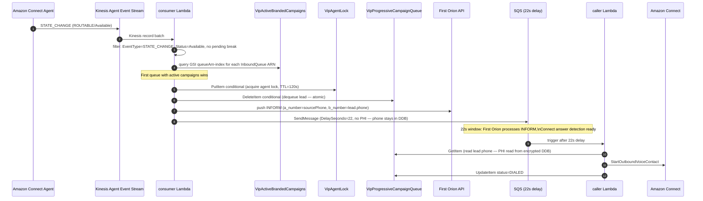

# Architecture

This document is the deep architectural reference for the **VIP Connect External Campaigns** platform. Pair it with `TECHNICAL_HANDOFF.md` for environment specifics and `DATA_DICTIONARY.md` for record schemas.

---

## 1. C4 Container Diagram

```mermaid
flowchart TB
    subgraph Browser["Operator Browser"]
        UI[VIP Admin UI<br/>React 18 + Vite + TS]
    end

    subgraph CDN["AWS Edge"]
        CF[CloudFront<br/>E3QCDJPG0LCO7E]
        S3[(S3<br/>vip-admin-ui-assets-165505826690)]
        CF --> S3
    end

    subgraph Auth["Auth"]
        COG[Cognito User Pool<br/>us-east-1_MeEkWO4P4]
    end

    subgraph Lambdas["Lambda Functions (Python 3.12)"]
        APL[api-plans<br/>1024MB, 5min, VPC]
        APC[api-campaigns]
        APM[api-metrics]
        APP[api-profiles]
        APS[api-segments]
    end

    subgraph Layer["Lambda Layer"]
        SH[vip_shared<br/>StructuredLogger<br/>OutboundCampaignsClient<br/>RedisLeadSource<br/>CustomerProfilesClient<br/>audit, filter, schedule, ...]
    end

    subgraph Data["Data Stores"]
        DDB[(DynamoDB<br/>VipAdminPlans)]
        REDIS[(ElastiCache Redis<br/>wait_list:{team}:list)]
        AUDIT[(DynamoDB<br/>VipAdminAudit)]
    end

    subgraph External["External AWS Services"]
        CC[Amazon Connect<br/>Campaigns V2]
        CP[Customer Profiles]
        SNS[(SNS<br/>vip-plans-alerts)]
        EB[EventBridge<br/>Scheduler]
        CW[CloudWatch<br/>Logs + Metrics]
        KMS[KMS CMK]
    end

    UI --> CF
    UI --> COG
    UI -->|REST + JWT| APL
    UI --> APC
    UI --> APM
    UI --> APP
    UI --> APS

    APL --> SH
    APC --> SH
    APM --> SH
    APP --> SH
    APS --> SH

    APL --> DDB
    APL --> REDIS
    APL --> CC
    APL --> CP
    APL --> SNS
    APL --> EB
    EB --> APL

    APC --> CC
    APP --> CP
    APS --> CP
    APS --> REDIS
    APM --> AUDIT
    APM --> CW

    SH --> CW
    SH --> AUDIT

    DDB -.encrypt.-> KMS
    REDIS -.encrypt.-> KMS

    subgraph ProgressiveDialer["Progressive Branded Dialer (ApiProgressiveDialerStack)"]
        KIN[Kinesis Agent Event Stream]
        CONS[consumer Lambda]
        SQS_PD[SQS vip-progressive-dialer-calls\n22s delay]
        CALL[caller Lambda]
        SEED[seeder Lambda]
        ACB[(DynamoDB\nVipActiveBrandedCampaigns)]
        CPQ[(DynamoDB\nVipProgressiveCampaignQueue)]
        ALK[(DynamoDB\nVipAgentLock)]
        FO[First Orion API\nINFORM push]
    end

    KIN --> CONS
    CONS --> ACB
    CONS --> ALK
    CONS --> CPQ
    CONS --> FO
    CONS --> SQS_PD
    SQS_PD --> CALL
    CALL --> CPQ
    APL -->|invoke seeder| SEED
    SEED --> CPQ
    SEED --> SH
    CALL -->|StartOutboundVoiceContact| CC
```

---

## 2. C4 Component Diagram — api-plans



Key file roles:

| File | Role |
|---|---|
| `handler.py` | Lambda entry point. Distinguishes HTTP invocation (API Gateway shape) from EventBridge invocation (`detail-type` shape). |
| `router.py` | Maps method + path to handler module functions. |
| `handlers/plans.py` | CRUD over Plan META records. |
| `handlers/runs.py` | Run lifecycle: `trigger_run`, `get_run`, `list_runs`, `abort_run`, `apply_plan_to_run`, `force-finish`. |
| `executor.py` | The orchestration brain. Implements `start_run`, `tick`, `_prestart_plan`, `_dispatch_ready_campaigns`, `_advance_bucket`, `_expire_bucket`, `_complete_run`, `start_run_chained`. |
| `builders.py` | Pure-function builders: segment names, segment group filters, campaign parameter dicts, flow ARN resolution (`campaign-{STATE}` and `Test-Journey-Flow`). |
| `store.py` | DynamoDB persistence layer for `VipAdminPlans`. Owns optimistic locking via `_version`. |
| `scheduler_manager.py` | Wraps EventBridge `PutRule`/`PutTargets`/`DeleteRule` calls; rule naming `vip-plan-{runId}-{bucketIndex}`. |

---

## 3. State Machine



Guards / invariants:

- A run transitions to terminal only when **every** bucket is terminal.
- A bucket transitions to `completed` only when **every** campaign is terminal.
- `_version` MUST increase on every `save_run`; concurrent writes are rejected (`ConcurrentWriteError`).
- `runLock` on the plan METADATA prevents two simultaneous runs of the same plan.
- The 19:00 COT cutoff is checked inside `tick()` and overrides every other transition.

---

## 4. Pre-warm Flow



Why it matters: Connect V2 enforces `startTime >= now + 6m`. Without pre-warm, a campaign triggered at 08:30 starts dialling at 08:36, losing 6 minutes per bucket. Pre-warm reclaims that.

---

## 5. Architecture Decision Records

### ADR-001 — Amazon Connect V2, segment-driven

**Status:** Accepted.
**Context:** Connect Campaigns offers two ingestion modes: external push (`PutDialRequestBatch`) and segment-driven (a Customer Profiles segment ARN attached to the campaign). External push was attempted in prototype; Connect returned `Operation is not valid` at `StartCampaign`. The instance is provisioned with segment-driven dialing.
**Decision:** All campaigns are created with a `source.customerProfilesSegment.segmentDefinitionArn`. Lead lists in Redis are translated into Customer Profiles segments at runtime.
**Consequences:** A new segment definition is created per campaign per run (timestamp-encoded name). Segment garbage collection is required eventually (see TD-013).

### ADR-002 — DynamoDB single-table, optimistic locking via `_version`

**Status:** Accepted.
**Context:** The two access patterns — "get plan by id" and "list runs for plan" — share the same partition. Concurrent writes (tick + abort, tick + prestart) must not lose data.
**Decision:** PK=`PLAN#{planId}`, SK=`META` or `RUN#…`. Writes to runs use `ConditionExpression="attribute_not_exists(#v) OR #v = :current_v"` so the very first write succeeds and every subsequent one rejects when stale.
**Consequences:** Callers must catch `ConcurrentWriteError` and either retry or bail; ticks bail because the winning writer already applied state.

### ADR-003 — EventBridge Scheduler, one rule per active bucket

**Status:** Accepted.
**Context:** Earlier designs had one rule per run; that didn't model parallel buckets. A rule per campaign was too many rules.
**Decision:** Each running or warming bucket has its own rule `vip-plan-{runId}-{bucketIndex}`. Created on bucket activation, deleted on bucket terminal.
**Consequences:** Rule cleanup is critical; orphan rules fire ticks against completed runs and silently waste compute. A daily janitor task is on the backlog.

### ADR-004 — COT is UTC-5, no DST, computed without pytz

**Status:** Accepted.
**Context:** Colombia does not observe DST. Using `pytz`/`zoneinfo` with the wrong assumptions caused a 1-hour drift in testing.
**Decision:** All COT calculations use `datetime.now(timezone.utc) + timedelta(hours=-5)`. The `_DAILY_CUTOFF_HOUR = 19` constant lives in `executor.py`.
**Consequences:** If Colombia ever adopts DST this constant breaks. No current risk.

### ADR-005 — SNS topic imported by ARN, not CDK-managed

**Status:** Accepted.
**Context:** The CDK execution role inside the `EngineeringPermissionBoundary` cannot call `SNS:CreateTopic` or `SNS:GetTopicAttributes`. CDK deploys failed at synth-time.
**Decision:** Topic is created manually once. CDK uses `sns.Topic.fromTopicArn` to import it. The execution role still gets `sns:Publish` granted.
**Consequences:** Subscriptions are managed via console/CLI, not IaC. They are listed in `INTEGRATION_CONTRACTS.md`.

### ADR-006 — Shared Lambda Layer (`vip_shared`)

**Status:** Accepted.
**Context:** Five api-* Lambdas share the same StructuredLogger, OutboundCampaignsClient, RedisLeadSource, audit, filter evaluator, schedule evaluator, and Customer Profiles client. Inlining duplicates code and bloats deployment artifacts.
**Decision:** Publish a single Lambda Layer containing `vip_shared/…` under `python/`. Each Lambda imports `from vip_shared.infrastructure...`.
**Consequences:** Layer version pinning is the source of truth for shared behaviour. A layer bump must be followed by a Lambda code update to pick it up.

### ADR-007 — Pre-warm via `pendingWarmup` on the plan record

**Status:** Accepted.
**Context:** Connect V2 enforces `startTime >= now + 6m`. Without pre-warm, every time-triggered bucket starts dialling 6 minutes late.
**Decision:** A separate `prestart_check` EventBridge rule scans plans for triggers 4–6 minutes from now and pre-creates + pre-starts stage-1 campaigns. The pre-warmed identifiers are written to `pendingWarmup` on the Plan META. `start_run` consumes and clears it.
**Consequences:** Two writes to the Plan record per pre-warm cycle, partial-warmup recovery on retry, and cleanup of `pendingWarmup` on abort.

### ADR-008 — Flow ARN resolved by name convention

**Status:** Accepted.
**Context:** Hardcoding contact-flow ARNs across environments is brittle. Operator-facing UI shouldn't expose ARNs.
**Decision:** `builders.resolve_campaign_flow_arn(state_code)` looks up `campaign-{STATE}` (e.g. `campaign-NY`) via `connect:ListContactFlows`. If missing, the function auto-creates a canonical CAMPAIGN-typed flow. `resolve_journey_flow_arn()` looks up `Test-Journey-Flow` (singular; same flow for all states).
**Consequences:** Renaming a flow in the Connect console breaks campaigns. Auto-creation requires `connect:CreateContactFlow` IAM (granted).

---

## 6. Progressive Branded Dialer — Architecture

### Overview

El Progressive Branded Dialer es una capa de infraestructura separada (`ApiProgressiveDialerStack`) que dispara llamadas salientes branded en respuesta a disponibilidad del agente, no a un scheduler. A diferencia de las campañas Connect V2 (segment-driven, el dialer maneja el timing), aquí la aplicación controla exactamente cuándo se llama a cada lead.

### Flow



### Multi-agent concurrency

Tres capas de aislamiento previenen double-dispatch cuando múltiples agentes van Available simultáneamente:

1. **Kinesis → una invocación Lambda por registro.** Cada `STATE_CHANGE` genera un registro independiente procesado en paralelo.
2. **Agent lock por agente ARN.** `VipAgentLock` PutItem condicional (`attribute_not_exists OR TTL expirado`). Un agente solo puede tener un dispatch activo. No bloquea otros agentes — los locks son por ARN.
3. **Dequeue atómico por lead.** `VipProgressiveCampaignQueue` DeleteItem condicional garantiza que solo un caller elimina cada lead. Si dos invocaciones concurrentes llegan al mismo lead, una gana y la otra recibe `None` y libera su lock.

### PHI handling

- El `phone` del lead **nunca entra al mensaje SQS** ni a los logs del consumer. Solo se loguea el `contactSk` (SK del item en DDB).
- El caller Lambda lee el teléfono directamente de DDB (KMS-encrypted) en el momento de llamar.
- First Orion recibe el teléfono solo en el API call HTTP (TLS en tránsito); no se loguea.

### DynamoDB tables

| Tabla | PK | SK | Propósito |
|---|---|---|---|
| `VipActiveBrandedCampaigns` | `CAMPAIGN#{campaignId}` | — | Campañas activas con config (queueArn, flowId, sourcePhone, priority). GSI: `queueArn-index`. |
| `VipProgressiveCampaignQueue` | `campaignId` | `{timestamp}#{contactUUID}` | Lead queue. TTL=24h. status: PENDING→DIALED. |
| `VipAgentLock` | `agentArn` | — | Lock activo por agente. TTL=120s (auto-expira si caller Lambda falla). |

### Seeder flow (api-plans → seeder Lambda)

Cuando el executor detecta `deliveryType: "branded"`:

1. `_start_one_campaign` obtiene el `segmentName` (via `pinnedSegmentArn` o `_create_segment`).
2. Invoca `vip-admin-progressive-dialer-seeder` con `campaignId` + `segmentName` + `campaignConfig`.
3. El seeder lee el segmento CP, extrae teléfonos del `segmentGroups.PhoneNumber.INCLUSIVE` filter, y escribe cada teléfono como item PENDING en `VipProgressiveCampaignQueue`.
4. El executor registra la campaña en `VipActiveBrandedCampaigns` con el `queueArn` de la config (que debe coincidir con una InboundQueue de los agentes asignados).

### Segment strategy para branded campaigns

Las campañas branded no usan Connect V2 segment-driven dialing — usan `StartOutboundVoiceContact` directo. El segmento CP sirve solo como fuente de la lista de teléfonos. Se construye con `PhoneNumber.INCLUSIVE` (no `ID.INCLUSIVE`) porque CP no indexa los Lead IDs del CRM; solo el teléfono es buscable directamente sin `BatchGetProfile`.

---

### ADR-009 — InboundQueues como lookup key para campañas branded

**Status:** Accepted.
**Context:** Las campañas branded se registran en `VipActiveBrandedCampaigns` contra la queue que los agentes atienden (InboundQueue). El Agent Event Stream reporta tanto `DefaultOutboundQueue` (queue para llamadas agente-iniciadas) como `InboundQueues` (queues del routing profile). El consumer inicialmente solo buscaba por `DefaultOutboundQueue` y nunca encontraba campañas.
**Decision:** `extract_agent_info` retorna ambas: `queue_arn` (DefaultOutboundQueue) e `inbound_queue_arns` (lista). El consumer itera todas y usa la primera con campañas activas como `matched_queue_arn`. El SQS message incluye `matched_queue_arn` (no el DefaultOutboundQueue del agente) porque el caller Lambda extrae el queue ID de Connect de ahí.
**Consequences:** Si un agente tiene muchas InboundQueues, el lookup hace N queries al GSI. Con el scale actual (<5 queues por agente) es negligible.

### ADR-010 — PhoneNumber.INCLUSIVE en lugar de ID.INCLUSIVE para branded segments

**Status:** Accepted.
**Context:** CP no indexa los Lead IDs del CRM (UUIDs externos). `customer_ids_to_segment_groups` con `ID.INCLUSIVE` creaba segmentos válidos en CP pero con 0 profiles porque los UUIDs no mapeaban a ningún ProfileId interno. La única forma de filtrar profiles por leads del CRM sin `BatchGetProfile` por cada lead es usar el teléfono, que CP sí almacena como `PhoneNumber`.
**Decision:** `_create_segment` usa `phones_to_segment_groups` (PhoneNumber.INCLUSIVE, chunks de 50). El seeder lee los teléfonos directamente del `segmentGroups` definition sin necesidad de resolve adicional.
**Consequences:** Si dos leads tienen el mismo teléfono (landline compartido), CP retorna un profile que puede ser dialed dos veces en runs distintos. Aceptable en el contexto actual.

### ADR-011 — SQS delay de 22s para ventana First Orion + answer detection

**Status:** Accepted.
**Context:** First Orion INFORM debe procesarse antes de que el teléfono suene para que el branded caller ID aparezca en el device del contacto. `StartOutboundVoiceContact` inicia el dial inmediatamente. Se necesita una ventana entre el push INFORM y el dial.
**Decision:** El consumer envía First Orion push y luego encola en SQS con `DelaySeconds=22`. El caller Lambda se ejecuta 22s después cuando First Orion ya propagó la información. Este delay también da tiempo para que Connect procese la respuesta del agente.
**Consequences:** El lead no es llamado en los primeros 22s desde que el agente va Available. Si el agente va Unavailable en esos 22s, la llamada se inicia de todos modos (el caller no verifica disponibilidad del agente antes de `StartOutboundVoiceContact`).

### ADR-012 — TTL de 24h en VipProgressiveCampaignQueue

**Status:** Accepted.
**Context:** Si el plan termina o es cancelado mientras quedan leads PENDING, esos items deben limpiarse solos. Un janitor activo que borre items al terminar la campaña es más complejo que un TTL.
**Decision:** Todos los items de `VipProgressiveCampaignQueue` tienen TTL=now+86400s (24h) al crearse. DynamoDB los elimina automáticamente. Campañas branded no duran más de 1 día de trabajo.
**Consequences:** Items DIALED también se limpian a las 24h. No hay historial persistente de dials en esta tabla — el audit trail vive en CloudWatch logs del caller Lambda.

---

## 8. Technical Debt Register

| ID | Title | Impact | Effort | Notes |
|---|---|---|---|---|
| TD-001 | No staging environment | HIGH | HIGH | Production is the only environment. Smoke tests rely on real traffic. |
| TD-002 | stdlib `logger.*` invisible in CloudWatch | MEDIUM | MEDIUM | `_slog` (StructuredLogger) works; legacy `logger.info(...)` lines emit nothing useful. Convert remaining call sites. |
| TD-003 | No frontend tests | MEDIUM | HIGH | Vitest + Testing Library scaffolding required. |
| TD-004 | ESLint not configured in frontend | LOW | LOW | Add `eslint.config.mjs`, plug into `npm run lint`. |
| TD-005 | `reconcileRetryLimit=1` legacy snapshots | MEDIUM | LOW | Either bump on read or run a one-time migration script. Currently surfaces as false `skipped_empty`. |
| TD-006 | Single-account deployment | HIGH | HIGH | Medwork HIPAA policy mandates dedicated account per workload. Inherited shared account. |
| TD-007 | No CI/CD pipeline | HIGH | MEDIUM | All deploys are manual `deploy.sh` runs. |
| TD-008 | No integration tests | MEDIUM | HIGH | All 262 tests are pure unit tests with `boto3` stubbed. |
| TD-009 | No HTTP-layer tests for `handlers/plans.py` or `handlers/runs.py` | MEDIUM | LOW | Coverage stops at executor + store. |
| TD-010 | Compiled `*.js`/`*.d.ts` in `infra/` untracked / partly committed | LOW | LOW | Update `.gitignore`. |
| TD-011 | `startTime = now + 6m` permanent on pre-warm failure | MEDIUM | MEDIUM | Recovery requires next bucket pre-warm cycle. |
| TD-012 | No canary / blue-green Lambda deploy | MEDIUM | HIGH | Hard-cutover `update-function-code`. CodeDeploy alias-shifting would close this. |
| TD-013 | Customer Profiles segment definitions never garbage-collected | LOW | LOW | Each run creates 1 segment per campaign. Slow leak; add a daily janitor. |
| TD-014 | System `zip` broken on dev host | LOW | LOW | `deploy.sh` uses Python `zipfile` workaround; document in onboarding. |
| TD-015 | No branded campaign progress UI | MEDIUM | MEDIUM | `VipProgressiveCampaignQueue` solo visible via DDB console. Falta contador PENDING/DIALED en PlanDetail. |
| TD-016 | Caller Lambda no verifica disponibilidad del agente antes de dial | MEDIUM | LOW | Si el agente va Unavailable en la ventana de 22s, la llamada se inicia sin agente disponible. Agregar check de agent state antes de `StartOutboundVoiceContact`. |
| TD-017 | Branded campaign no tiene mecanismo de stop/cancel desde UI | MEDIUM | MEDIUM | Para detener un branded campaign hay que borrar el item de `VipActiveBrandedCampaigns` manualmente. Falta botón de stop en PlanDetail. |
| TD-018 | Agent lock TTL hardcoded a 120s | LOW | LOW | Si el caller Lambda falla después de los 120s, el agente no puede recibir otro dispatch hasta que el TTL expire. Configurable via env var sería mejor. |
