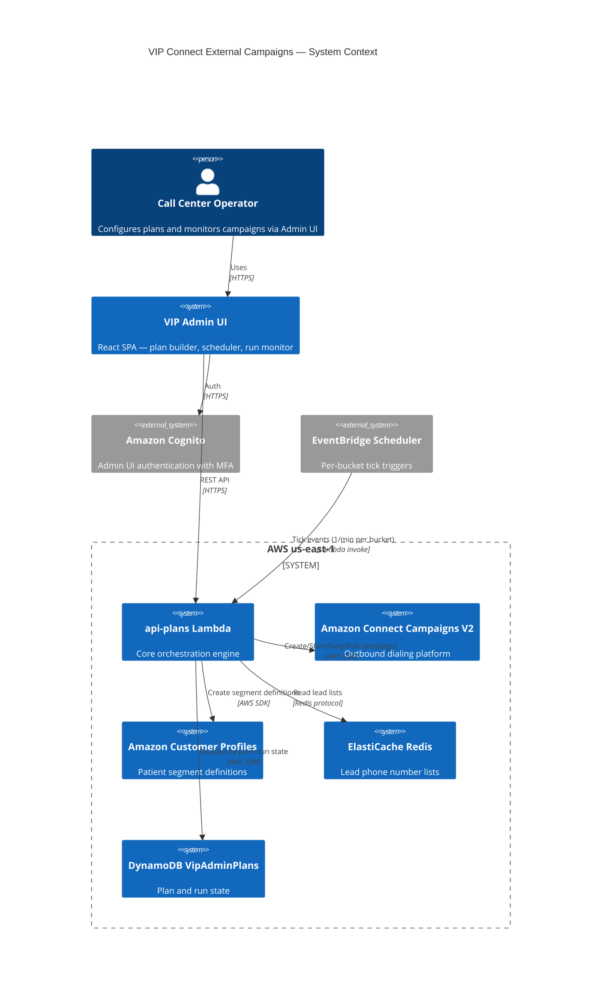

# VIP Connect External Campaigns — Technical Handoff

**Audience:** Senior engineer taking ownership of the platform.
**Last verified:** 2026-05-28
**Production AWS Account:** 165505826690 (us-east-1)
**Live hours:** Daily 08:00 – 19:00 COT (UTC-5, no DST)

---

## 1. System Overview

VIP Connect External Campaigns is an outbound dialing orchestration platform built for VIP Medical Group (HIPAA-regulated healthcare). It orchestrates **Amazon Connect Campaigns V2** (predictive/progressive outbound dialing) on top of patient segments stored in **Amazon Customer Profiles**, fed by lead phone lists in **ElastiCache Redis**.

Call-center operators configure multi-bucket **Plans** through the Admin UI. Each plan contains an ordered set of **Buckets**, and each bucket contains one or more **Campaigns** that target a specific geography (NY, LI, NJ, CT, MD, TX, NCA, SCA) and a lead segment group (e.g. "Cancellation / 1st attempt"). Campaigns inside a bucket form a DAG via the `dependsOn` field.

The system runs autonomously between **08:00 and 19:00 COT**:

- Auto-starts plans by scheduled time, manual trigger, or `on_plan_complete` chaining
- Creates Customer Profiles segment definitions on the fly
- Creates and starts Amazon Connect campaigns
- Polls campaign state on a one-minute tick driven by EventBridge Scheduler
- Cascades stage-N campaigns when their parents complete
- **Pre-warms** stage-1 campaigns of the *next* bucket 5 minutes before the current bucket expires to absorb the Connect 6-minute scheduling offset
- Hard-stops every campaign at the 19:00 COT cutoff

Five Lambda functions implement the backend; a React SPA served from CloudFront drives the UI.

---

## 2. Architecture Summary

### C4 Context



### Key design choices

| Decision | Why |
|---|---|
| Segment-driven Connect V2 (not external push) | External push is rejected by Connect with `Operation is not valid`. The instance is configured for segment-driven dialing. |
| DynamoDB single-table (`VipAdminPlans`) | Two access patterns — plan lookup and per-plan run history — both satisfied by PK=`PLAN#{planId}`, SK=`META` or `RUN#…`. |
| Optimistic locking via `_version` | Concurrent tick + abort writes are rare but must converge. `attribute_not_exists(_version) OR _version = :v` allows the first write and serialises subsequent ones. |
| Per-bucket EventBridge schedule | Each running bucket has its own rule (`vip-plan-…`); deleted on bucket completion. Cheaper than one schedule per campaign and matches the executor model. |
| Pre-warm via `pendingWarmup` on the plan record | Connect V2's `StartCampaign` requires `startTime >= now + 6m`. Creating campaigns 5–6 minutes before officially starting a bucket cancels out that latency. |
| Imported SNS topic | The CFN execution role inside `EngineeringPermissionBoundary` cannot call `SNS:GetTopicAttributes`. The topic is created manually and imported by ARN. |

---

## 3. Infrastructure Inventory

| Resource Type | Name | Purpose | Key Config |
|---|---|---|---|
| DynamoDB table | `VipAdminPlans` | Plan META + run records | PK=`pk`, SK=`sk`, PAY_PER_REQUEST, CMK encryption, PITR enabled, deletion protected, RETAIN |
| ElastiCache Redis | (cluster in private VPC) | Lead phone lists `wait_list:{team}:list` | Reached from VPC-attached Lambdas only; ENV `REDIS_HOST`/`REDIS_PORT` |
| Lambda | `vip-admin-ui-api-plans` | Plan/run orchestration, tick, prestart | Python 3.12, 1024 MB, 5 min timeout, VPC, reservedConcurrentExecutions=5 |
| Lambda | `vip-admin-ui-api-campaigns` | Manual campaign CRUD | Python 3.12 |
| Lambda | `vip-admin-ui-api-metrics` | Audit log surface + CloudWatch metrics | Python 3.12 |
| Lambda | `vip-admin-ui-api-profiles` | Customer Profiles ops | Python 3.12 |
| Lambda | `vip-admin-ui-api-segments` | Segment management, estimates, reconcile | Python 3.12 |
| Lambda | `vip-admin-ui-campaign-exporter` | CSV/PDF export of completed campaigns | Imported (out-of-band deploy) |
| Lambda Layer | `vip-shared` | StructuredLogger, OutboundCampaignsClient, RedisLeadSource, Customer Profiles client, audit, filter evaluator | Built by `infra/lib/utils/shared-layer.ts`; bundled into each api-* function |
| CloudFront | `E3QCDJPG0LCO7E` | Admin UI distribution | Origin: S3 `vip-admin-ui-assets-165505826690`; HTTPS only |
| S3 | `vip-admin-ui-assets-165505826690` | Static React SPA bundle | Block public access, OAC, KMS at rest |
| Cognito User Pool | `us-east-1_MeEkWO4P4` (`vip-admin-ui-pool`) | Admin UI auth | MFA enforced (TOTP), 15-min idle timeout |
| SNS topic | `arn:aws:sns:us-east-1:165505826690:vip-plans-alerts` | Plan/run alerts to operators | Imported by ARN, subscribed manually |
| EventBridge Scheduler rules | `vip-plan-*`, `vip-sched-*` | Per-bucket tick (1/min) and prestart_check (1/min) | Targets api-plans Lambda |
| KMS key | (CMK referenced by `DATA_KEY_ARN`) | At-rest encryption for DDB, logs, S3 | Annual rotation, separate key admin & user roles |
| CloudWatch Log Group | `/aws/lambda/vip-admin-ui-api-plans` | Structured JSON logs | 1-year retention, CMK encrypted, RETAIN |
| IAM Permissions Boundary | `EngineeringPermissionBoundary` | Hard cap on all Lambda exec roles | Blocks SNS topic creation, IAM passrole expansion, etc. |
| Amazon Connect | Instance `6b3f17ba-68a4-472a-9b20-db1991507009` | Voice queues, campaign flows | Flow names `campaign-{STATE}` (MANAGED) + `Test-Journey-Flow` (JOURNEY) |
| Amazon Customer Profiles | Domain via `PROFILES_DOMAIN_NAME` env | Segment definitions for Connect | Segments created at run-time per (state, group, timestamp) |

---

## 4. Happy-Path Data Flow

```mermaid
sequenceDiagram
    autonumber
    participant Op as Operator
    participant UI as Admin UI (React)
    participant L as api-plans Lambda
    participant DDB as DynamoDB VipAdminPlans
    participant EB as EventBridge Scheduler
    participant CP as Customer Profiles
    participant Redis as ElastiCache Redis
    participant CC as Connect Campaigns V2

    Op->>UI: Create plan + bucket + campaign
    UI->>L: PUT /plans
    L->>DDB: PutItem pk=PLAN#id sk=META
    Op->>UI: Schedule trigger (time 08:30 COT)
    UI->>L: PATCH /plans/{id} trigger=time
    L->>DDB: Update trigger field
    Note over L: prestart_check fires every minute
    EB->>L: prestart_check (1/min)
    L->>DDB: Scan plans where trigger.type=time
    L->>CP: CreateSegmentDefinition (pre-warm)
    L->>CC: CreateCampaign + StartCampaign(startTime=now+6min)
    L->>DDB: SET pendingWarmup
    Note over EB,L: Trigger time reached
    EB->>L: tick (time-trigger)
    L->>DDB: get_plan + create_run (snapshot)
    L->>DDB: bucket[0] -> status=running
    L->>EB: PutRule vip-plan-{runId}-{idx} (1/min)
    EB->>L: tick(plan_id, run_id, bucket_index)
    L->>Redis: HGETALL wait_list:{team}:list
    L->>CP: CreateSegmentDefinition (if not pre-warmed)
    L->>CC: GetCampaignState (poll running campaigns)
    L->>DDB: save_run (advance state, _version+=1)
    Note over L: Stage-N campaigns whose parents finished -> _start_one_campaign
    L->>CC: StopCampaign on bucket expire / 19:00 COT
    L->>DDB: campaign.status=completed; bucket.status=completed
    L->>EB: DeleteRule vip-plan-{runId}-{idx}
    L->>DDB: run.status=completed
```

---

## 5. Deployment Guide

### Backend — api-plans (and any api-* service)

```bash
cd services/api-plans
bash deploy.sh
```

The script:
1. Builds the deployment zip with **Python's `zipfile` module** (the system `zip` binary on the dev host is broken — see TD-014).
2. Validates the layer hash against the published Lambda Layer ARN.
3. Updates the Lambda function code via `aws lambda update-function-code --function-name vip-admin-ui-api-plans --profile production`.
4. Waits for the function to enter `Active` state, then exits.

Always run unit tests **before** deploy:

```bash
cd services/api-plans
python -m pytest -q
```

### Backend — CDK stack changes

```bash
cd infra
npm ci
npx cdk synth
AWS_PROFILE=production npx cdk diff
AWS_PROFILE=production npx cdk deploy ApiPlansStack
```

### Frontend

```bash
cd frontend
npm ci
npm run build
aws s3 sync dist/ s3://vip-admin-ui-assets-165505826690/ --delete --profile production
aws cloudfront create-invalidation --distribution-id E3QCDJPG0LCO7E --paths "/*" --profile production
```

### Verification

After every deploy, the smoke test is:

```bash
aws logs tail /aws/lambda/vip-admin-ui-api-plans --profile production --since 5m --follow
```

Look for `{"service":"api-plans","event":"tick_complete", ...}` events with no `error` field.

---

## 6. Environment Variables (api-plans Lambda)

| Variable | Purpose | Example |
|---|---|---|
| `CONNECT_INSTANCE_ID` | Amazon Connect instance UUID | `6b3f17ba-68a4-472a-9b20-db1991507009` |
| `PROFILES_DOMAIN_NAME` | Customer Profiles domain | `vip-profiles-prod` |
| `LAMBDA_FUNCTION_ARN` | Self-ARN, used as EventBridge target | `arn:aws:lambda:us-east-1:165505826690:function:vip-admin-ui-api-plans` |
| `SNS_ALERTS_TOPIC_ARN` | Alerts topic | `arn:aws:sns:us-east-1:165505826690:vip-plans-alerts` |
| `PLANS_TABLE_NAME` | DynamoDB table | `VipAdminPlans` |
| `AUDIT_TABLE` | Audit log table | `VipAdminAudit` |
| `DATA_KEY_ARN` | CMK ARN for encryption | `arn:aws:kms:us-east-1:165505826690:key/…` |
| `REDIS_HOST` | ElastiCache primary endpoint | `vip-leads.xxx.use1.cache.amazonaws.com` |
| `REDIS_PORT` | Redis port | `6379` |
| `TEAM` | Lead list namespace | `vip` |
| `LOG_LEVEL` | StructuredLogger level | `INFO` |
| `POWERTOOLS_SERVICE_NAME` | Logger service tag | `api-plans` |

---

## 7. Known Issues & Technical Debt

1. **No staging environment.** Code is deployed directly to production after local tests. See TD-001 in `ARCHITECTURE.md`.
2. **stdlib `logger.*` calls invisible.** Inside `executor.py` the module-level `logger = logging.getLogger(__name__)` is mostly silenced by Lambda's root logger config. The `_slog` (`StructuredLogger`) emits to CloudWatch correctly; any remaining `logger.info(...)` calls are effectively dead. Migration ongoing.
3. **No frontend tests.** `frontend/test/` does not exist. Manual smoke testing only.
4. **No ESLint config in frontend.** TypeScript catches type errors at build, but lint debt is invisible.
5. **`reconcileRetryLimit=1` in legacy snapshots.** Plans created before the limit was raised to 5 still carry the old value inside `planSnapshot`. Empty-segment retries fail after one attempt → `exitReason=skipped_empty`.
6. **Single AWS account.** Per Medwork HIPAA standards, PHI workloads should run in a dedicated account. We are inheriting a shared account.
7. **Manual deploys.** No CI/CD pipeline yet. Every deploy is a developer's local `deploy.sh`.
8. **No integration tests.** All 262 tests are pure unit tests with `boto3` stubbed. No nightly E2E against staging.
9. **No HTTP-layer tests for `handlers/plans.py` or `handlers/runs.py`.** Coverage stops at executor + store.
10. **Compiled `*.js`/`*.d.ts` files inside `infra/` are sometimes committed.** `.gitignore` is incomplete.
11. **`startTime = now + 6 min` is permanent on cold start.** If pre-warm fails, the cold-started campaign starts 6 minutes late and that delay cannot be recovered until the next bucket.
12. **No canary / blue-green Lambda deploys.** `update-function-code` is a hard cutover. Roll-forward only.

---

## 8. Glossary

| Term | Meaning |
|---|---|
| **Plan** | Operator-defined configuration: name, trigger, optional loop, working hours, and an ordered list of Buckets. Stored as `PLAN#{id}` / `META`. |
| **Bucket** | Ordered phase of a plan. Contains one or more Campaigns and a `run_mode` (`time_based` or `status_based`). |
| **Campaign** | A Connect outbound dial job for one geography (state code) and one segment group, e.g. NY × "Cancellation / 1st attempt". |
| **Run** | A single execution of a Plan. Stored as `PLAN#{id}` / `RUN#{epoch_ms}-{uuid8}`. Carries `planSnapshot`, `bucketStates`, `_version`. |
| **BucketState** | Per-bucket run state: `queued`, `warming`, `running`, `completed`, `cancelled`, `expired`, `error`. |
| **CampaignState** | Per-campaign run state: `queued`, `warming`, `creating`, `running`, `completed`, `cancelled`, `expired`, `error`. |
| **Tick** | EventBridge Scheduler invocation of the api-plans Lambda once per minute per active bucket. Drives polling + dispatch. |
| **Pre-warm** | Creating + starting a Connect campaign 5–6 minutes before its officially scheduled time, to defeat the 6-minute startTime offset Connect requires. |
| **PendingWarmup** | Field on a Plan META record holding pre-warmed campaign references until `start_run` consumes them. Cleared on consumption. |
| **planSnapshot** | Immutable copy of the Plan made at run creation. The executor reads this, not the live plan, so edits during a run don't break it. |
| **COT** | Colombia Time, fixed UTC-5, no DST. All operator-facing times are COT. |
| **Delivery Type** | `campaign` (Connect MANAGED) or `journey` (Connect JOURNEY). Both are voice; flow ARN selection differs. |
| **Working Hours** | Optional `{days, startTime, endTime}` on a Plan limiting which days/hours buckets may run. |
| **Reconcile** | Re-querying Customer Profiles for a freshly-created segment to confirm members materialised. Retries up to `reconcileRetryLimit`. |
| **Lead List** | Redis hash at `wait_list:{team}:list` mapping lead identifiers to phone numbers + segment group labels. Populated by an external feeder pipeline. |
| **Segment** | A Customer Profiles segment definition with filters over (state location, group label). Created per campaign. |
| **ExitReason** | Final reason a campaign exited: `completed`, `stopped`, `expired`, `bucket_expired`, `error`, `skipped_empty`, `reconcile_failed`, `creation_failed`, `cancelled`, `parent_cancelled`, `aborted`, `cutoff_too_close`. |
