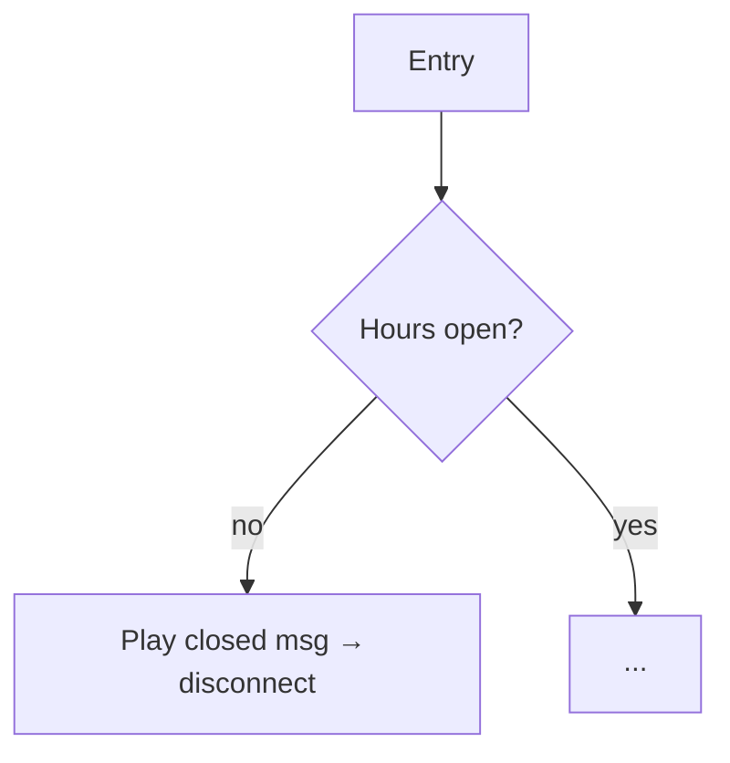

<!--
TEMPLATE — Contact flow spec (Diátaxis: reference + explanation)
Copy to flow-<name>.md, fill every <...>, delete this comment and any lines you don't need.
Ground truth = the flow's exported JSON (commit it to flows/<name>.json). No PHI / no real phone numbers.
-->

# Flow: <flow name>

| | |
|---|---|
| **Connect flow ID** | `<connectContactFlowId>` |
| **Type** | `<CONTACT_FLOW | CAMPAIGN | OUTBOUND_WHISPER | AGENT_WHISPER>` |
| **Built by** | CloudHesive |
| **Exported JSON** | `flows/<name>.json` |
| **Last verified** | `<YYYY-MM-DD>` by `<you>` |

## Purpose  *(explanation)*

<What this flow is for, in 2–3 sentences. When does it run? What outcome does it produce?>

## Entry / trigger

<Which phone number / campaign / "Transfer to flow" enters this flow? Is it invoked by an Outbound
Campaign V2 (source = a segment)? Inbound number? Whisper?>

## Block-by-block  *(reference)*

<Walk the flow in order. One row per meaningful block. Get this from the exported JSON.>

| # | Block type | What it does | Attributes set / read | Next → / error → |
|---|-----------|--------------|-----------------------|------------------|
| 1 | Set logging behavior | <enable/disable + why> | — | → 2 |
| 2 | Check hours of operation | <which schedule> | — | open → 3 / closed → <block> |
| 3 | <...> | <...> | <camelCaseAttr> | <...> |
| … | | | | |

## External calls

- **Lambda** `<function name>` — input `<attrs>` → output `<attrs>` — failure branch → `<block>`
- **Data table** `LocationBasedVoicemail-v2` — key `(campaignType, location, groups)` → `greeting`
  (see `data-table-locationbasedvoicemail-v2.md`)
- **Lex bot** `<name>` — <intent(s), fallback behavior> *(if any)*

## Contact attributes

| Attribute (camelCase) | Set / Read | Sensitive? | Logging disabled for this segment? |
|-----------------------|-----------|------------|------------------------------------|
| `<attr>` | Set | no | no |
| `<attr>` | Read | **yes** | **yes** |

## Error & fallback paths

<List EVERY error / no-match / timeout branch and where it goes. Confirm: no infinite loops; every path
ends at an agent, a bot, a transfer, or a clean disconnect. Note callback offers (Check queue status).>

## Dependencies

- **Queues:** `<...>`  ·  **Routing profiles:** `<...>` (see `queues-and-routing.md`)
- **Other flows** (Transfer to flow): `<...>`
- **Hours of operation:** `<...>`

## Diagram

<A call-flow diagram (IVR tree: prompts, DTMF options ≤5, decision points, error branches, terminal
states) and/or a C4-L3 component view. Commit it as code (Mermaid / draw.io) beside this file.>

## Open questions

<What you couldn't confirm from the JSON / console. Bring to a checkpoint — don't guess.>
