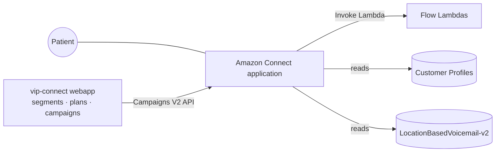

<!-- Diátaxis: explanation + reference. This is the FIRST deliverable: a discovery-first High-Level Design
     (HLD) of the whole Connect application. Fill the <...>; commit diagrams as code. Its OUTPUT (§9) scopes
     the per-flow docs that come next. No PHI, no real phone numbers, no account/instance IDs. -->

# Connect application — Architecture HLD (discovery)

> **This is the starting point.** Before documenting individual contact flows, we map the *whole* Connect
> application at a high level: what exists, how it fits together, and what we don't yet know. The unknowns
> and the prioritized flow list at the end (§9) become the backlog for the flow-documentation phase.

| | |
|---|---|
| **Status** | `<in discovery / draft / reviewed>` |
| **Author / Reviewer** | Luisa / Sebastian |
| **Method** | read-only exploration of the Connect console + Import/Export + code cross-refs |
| **Pairs with** | Connect deep-dive (onboarding doc 07) · Connect Documentation Kit (doc 15) |

## 1. Purpose & goals

<Why the Connect application exists (voice campaigns to patients, in hours, with a path to service) and
the quality goals we care about. Who the stakeholders are: operators, agents, our webapp, CloudHesive.>

## 2. Method & scope

- **How I'm discovering this:** enumerate every Connect resource (read-only), export each flow's JSON,
  cross-reference the webapp code (`api-campaigns`, `data-table-tools`) and doc 07.
- **In scope:** the Connect application (flows, queues, routing profiles, hours, numbers, quick connects,
  data tables, Lambdas invoked by flows, integrations).
- **Out of scope (already documented → link):** the lead pipeline, segments, plan executor, Campaigns V2
  API — see repo `docs/` + doc 07.

## 3. As-is inventory (fill from the console)

> The core discovery output. List everything that exists; depth comes later, per flow.

### Contact flows & flow modules
| Name | Type | Entry (number/campaign/transfer) | Reads data table? | Invokes Lambda? | Priority to deep-doc |
|------|------|----------------------------------|:-----------------:|:---------------:|:--------------------:|
| `<...>` | CONTACT_FLOW | `<...>` | yes/no | `<name>` | high/med/low |

### Queues
| Name | Purpose | Hours of operation | Reached by (flows/campaigns) |
|------|---------|--------------------|------------------------------|

### Routing profiles
| Name | Queues (priority/delay) | Skillset / agents | Overflow |
|------|-------------------------|-------------------|----------|

### Hours of operation
| Name | Timezone | Open hours | Holiday / emergency handling |
|------|----------|-----------|------------------------------|

### Phone numbers / entry points
| Number (mask) | Type | → Flow |
|---------------|------|--------|

### Quick connects / external transfers
| Name | Target (agent/queue/external) | Whisper flow |
|------|-------------------------------|--------------|

### Lambdas invoked by flows
| Lambda | Called from (flow/block) | Input attrs | Output attrs | Failure branch |
|--------|--------------------------|-------------|--------------|----------------|

### Data tables
| Name | Key → Value | Read by | Maintained by |
|------|-------------|---------|---------------|
| LocationBasedVoicemail-v2 | (campaignType, location, groups) → greeting | `<flows>` | `services/data-table-tools/` |

### Lex bots / integrations *(if any)*
| Name | Purpose | Used by |
|------|---------|---------|

## 4. Context (C4 Level 1)

<Narrate: who triggers a call, what the flows consult, where they can transfer.>

## 5. Building blocks (C4 Level 2)

<A container-level diagram: flows, queues, routing profiles, data table, Lambdas as boxes + how they
relate. Keep it high-level — component detail lives in the per-flow docs later.>

## 6. Runtime view — a call, end to end (high level)

<Trace ONE representative call at a high level: entry → hours/staffing/queue checks → greeting lookup →
agent / voicemail / transfer. Not block-by-block (that's the per-flow doc); just the shape.>

## 7. Data & integration map

<Where data comes from and goes: Customer Profiles (segments), the data table (greetings), the Lambdas,
any external transfer targets. How a Campaign V2 from our webapp enters a flow.>

## 8. Cross-cutting concerns

- **Security / PHI:** <where sensitive data appears; which flow segments disable logging; no PHI in logs>.
- **Out-of-IaC:** WAF / SNS / some IAM created via CLI (permission boundary) — `cdk diff` won't show drift.
- **Tech debt / risks:** <single points of failure (e.g. missing data-table row → no greeting); undocumented areas>.

## 9. Output — what to document next  *(this scopes the flow phase)*

### Open questions / unknowns register
| # | Question / unknown | Owner | Status |
|---|--------------------|-------|--------|
| 1 | `<...>` | Sebastian / CloudHesive | open |

### Prioritized flow backlog
| Order | Flow | Why this priority |
|-------|------|-------------------|
| 1 | `<the scoped starter flow>` | <most used / highest risk / best learning> |
| 2 | `<...>` | <...> |

## 10. Review & sign-off

<Reviewed by Sebastian on `<date>`. Notes.>
